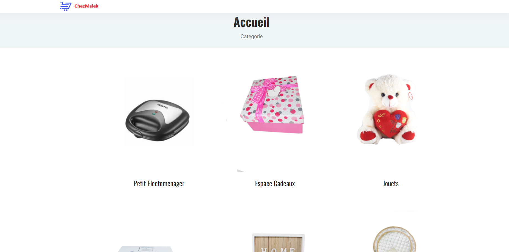
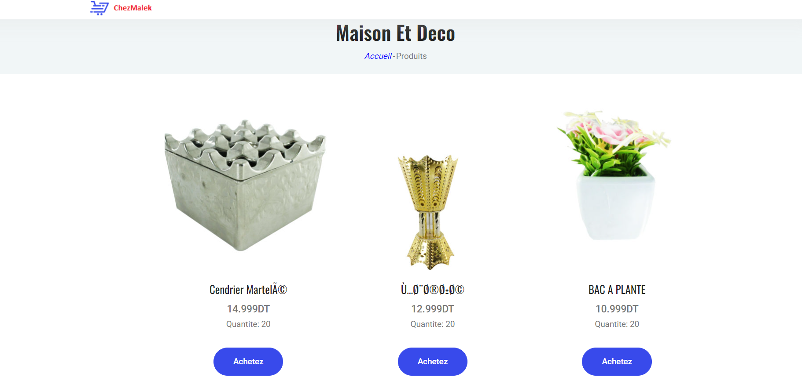
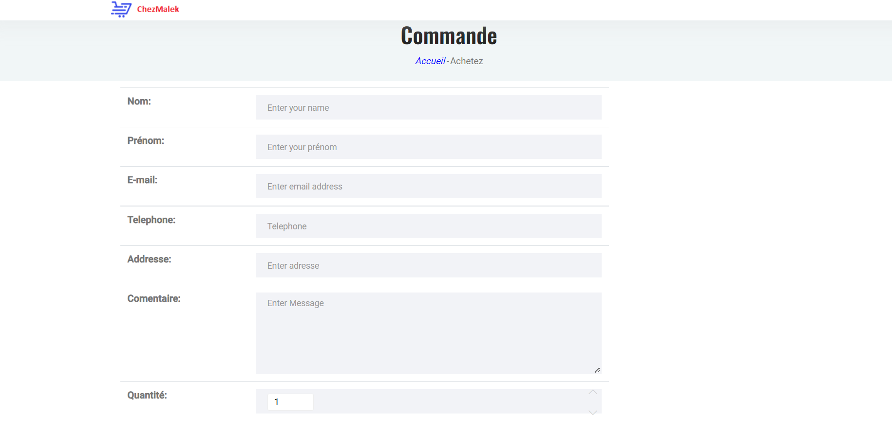
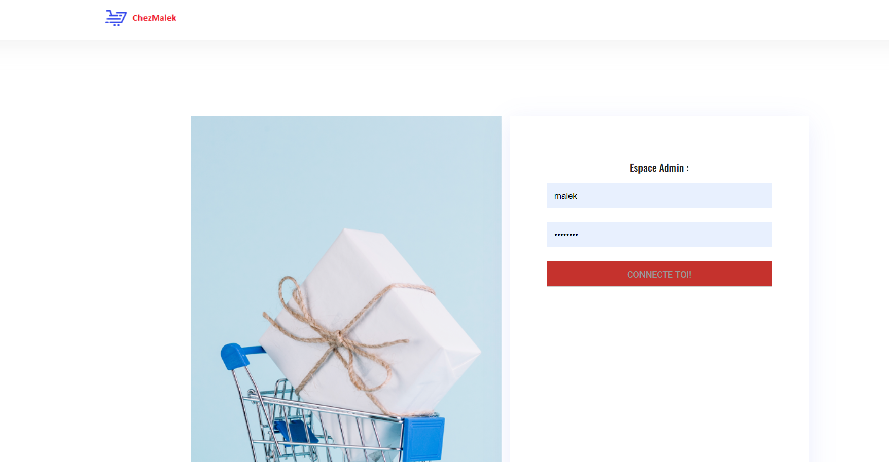
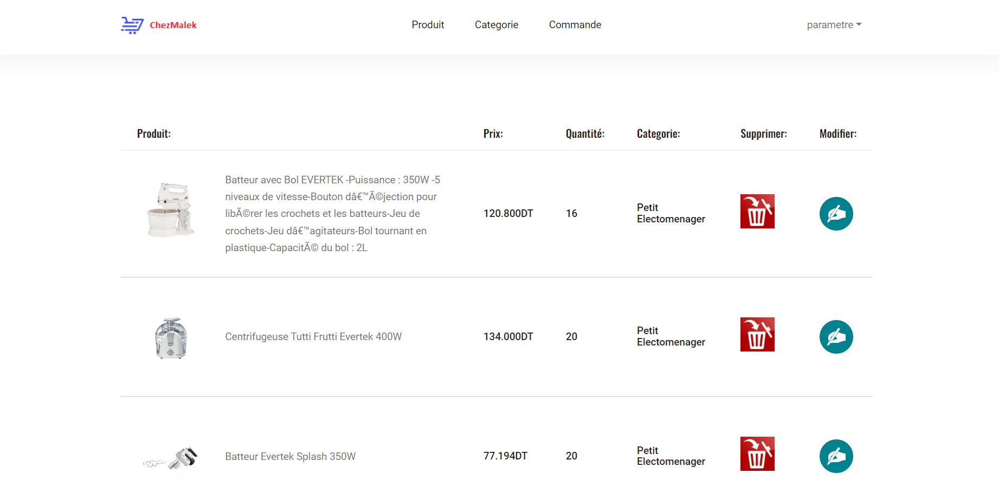

# Stage d'initiation (ONLINELTD)
 Encadrer par Mme.Souad CHALAKHI 

 Développement et conception d'une mini application e-commerce pour commander une seule produit 

# BASE DE DONNEE : PHPMYADMIN 
# PHP, HTML, CSS, JS
 

# Interface WEB

